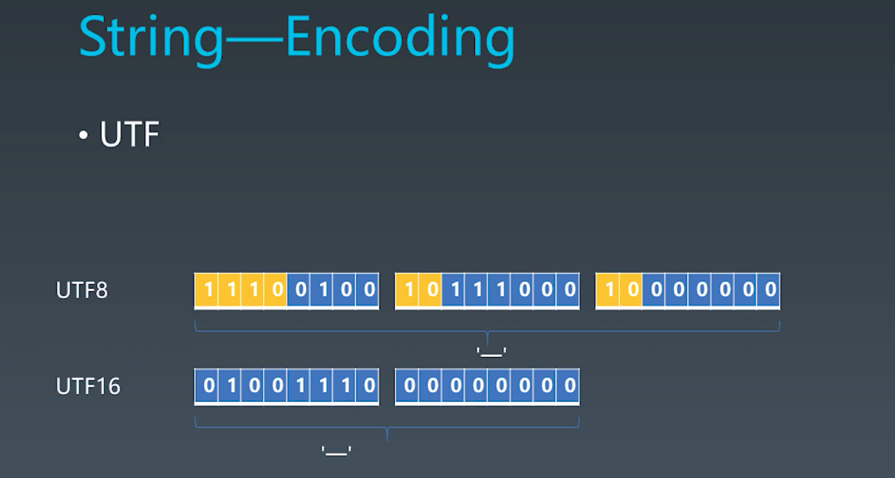

学习笔记
# 第六周
## 1. JS语言通识 | 泛用语言分类方法
* 非形式语言 ： 中文，英语
* 形式语言（乔姆斯基谱系）
  * 0- 型文法（无限制文法或短语结构文法）包括所有的文法。
  * 1- 型文法（上下文相关文法）生成上下文相关语言。
  * 2- 型文法（上下文无关文法）生成上下文无关语言。
  * 3- 型文法（正规文法）生成正则语言。

## 2. JS语言通识 | 什么是产生式

### 产生式（BNF）
1. 用尖括号括起来的名称来表示语法结构名
2. 语法结构分成基础结构和需要用其他语法结构定义的复合结构
   * 基础结构称终结符
   * 复合结构称非终结符
3. 引号和中间的字符表示终结符
4. 可以有括号
5. *表示重复多次
6. |表示或
7. +表示至少一次


### 练习

```
<BracketExpression> ::= <Number> | (<AdditiveExpression>)

<AdditiveExpression> ::= <MultiplicativeExpression> | <AdditiveExpression> + <MultiplicativeExpression> | <AdditiveExpression> - <MultiplicativeExpression>

<MultiplicativeExpression> ::= <BracketExpression> | <MultiplicativeExpression> * <BracketExpression> | <MultiplicativeExpression> / <Number>

```

## 3. JS语言通识 | 深入理解产生式

## 4. JS语言通识 | 现代语言的分类

形式语言-用途
1. 数据描述语言 ： JSON,HTML,XML,SQL,CSS
2. 编程语言：C, C++，Java,C#,Python,Ruby,Perl,Lisp,T-SQl,Clojure,Haskell,Javascript
   
形式语言-表达方式
1. 声明式语言 : JSON ,HTML,XAML,SQL,CSS,Lisp,Clojure,Haskell
2. 命令型语言 : C,C++,Java,C#,Python,Ruby,Perl,Javascript


## 5. JS语言通识 | 编程语言的性质

## 6. JS语言通识 | 一般命令式编程语言的设计方式

## 7. JS类型 | Number

Atom
1. Grammar
    * Literal
    * Variable
    * keywords
    * Whitespace
    * Line Terminator
2. Runtime
    * Types
    * Execution Context

Types
    1. Number
    2. String
    3. Boolean
    4. Object
    5. Null
    6. Undefined
    7. Symbol

IEEE 754 Double Float
    * Sign(1)
    * Exponent (11)
    * Fraction (52)


## 8. JS类型 | String



UTF8 
1. 编码有n位，第一个字节就n个1加一个0开头
2. 后面每个字节都以10开头


## 9. JS类型 | 其他类型

Boolean ： true  false

Null & Undefined
1. null值是关键字
2. undefined是个全局变量,但在局部可被重写，建议用void 0代替这个值

## 10. JS对象 | 对象的基础知识

Object：
1. 唯一性：任何对象都是唯一的，与它本身的状态无关
2. 状态：用来描述对象
3. 行为：状态的改变即为行为

Class ：归类 和 分类 是两个重要的流派
1. 归类：多继承
2. 分类：单继承

Prototype : 原型
1. 更接近人类原生认知的描述对象的方法
2. 不需要做严谨的分类，而采用相似的方式描述对象
3. 任何对象仅仅需要描述它自己与原型的区别

Class VS Prototype
1. Class 适合于比较严谨的场景，和类型系统有一定整合。
2. Prototype 认知成本低，选错成本低，适合于不那么清晰，描述更自由的一些场景

在设计对象的状态和行为时，总是遵循“行为改变状态”的原则

## 11. JS对象 | JS中的对象

Javascript用属性来统一抽象对象状态和行为
1. 数据属性：用于描述状态，如果存储函数也可以用于描述行为
2. 访问器属性：用于描述行为

当我们访问对象的属性时，如果对象不存在属性，会沿着对象的原型对象查找是否由此名称的属性。而原型对象还可能有原型。这就有了‘原型链’的说法


Object API/Grammar
1. {}  . [] Object.defineProperty : 基础的对象机制，访问属性，定义属性，改变属性
2. Object.create / Object.setPropertyOf / Object.getPropertyOf : 基于原型的API 
3. new / class / extends : 基于类的
4. new / function / prototype 


Host Object
